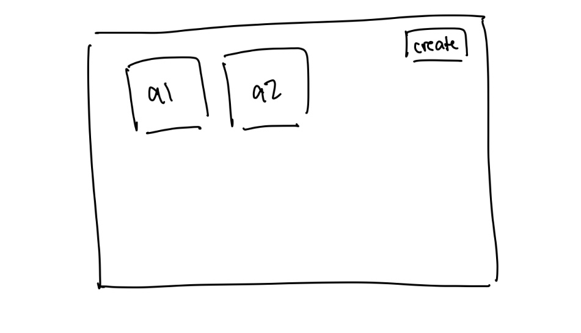
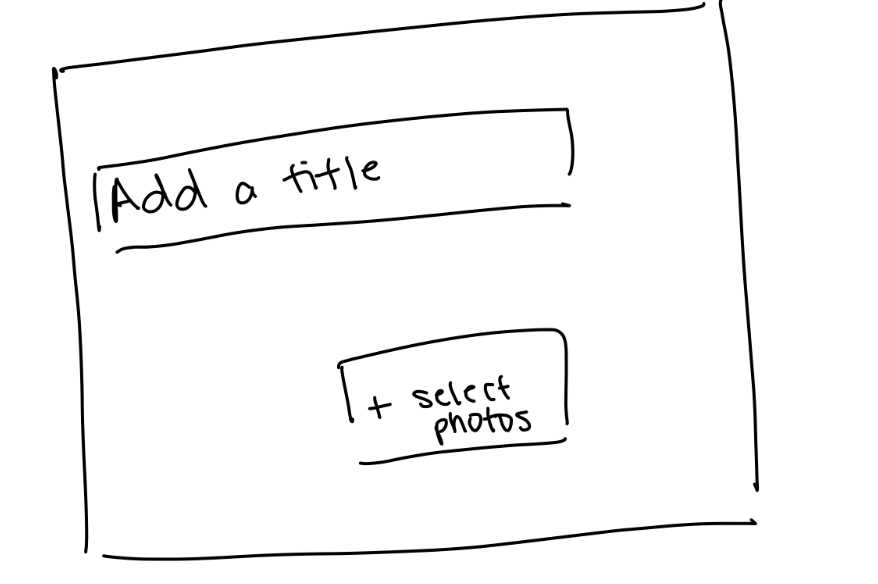
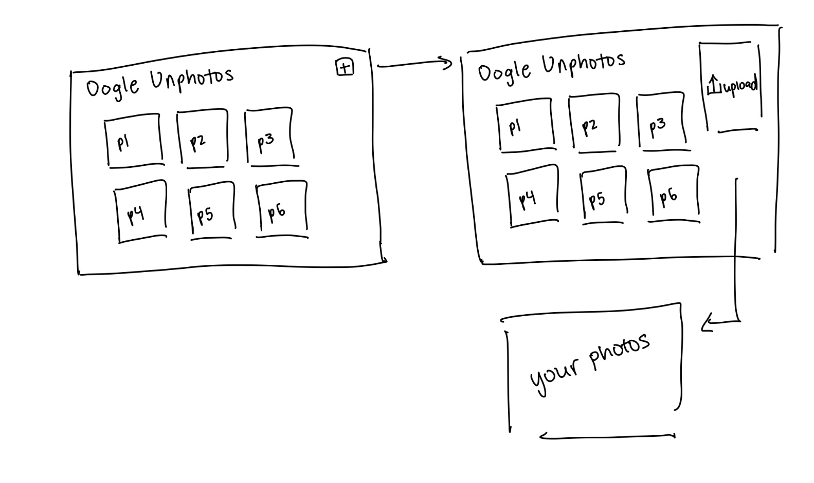
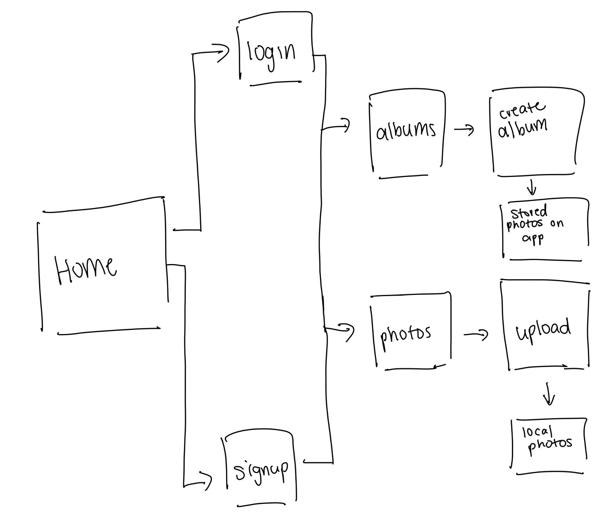

# Oogle Unphoto

## Overview

Oh no! Unfortunately, the photo storage service that you downloaded from the dark web, Oogle Unphoto, just broke up your uploaded photos into tiny scrambled pieces. Instead of seeing all your photos, you see a bunch of tile puzzles that you now have to solve. So sad.

Oogle Unphoto is a web app that stores the photos that you upload...but life isn't fair. Once the user's photos are uploaded to this photo storage app, the photos are cropped into a 3x3 grid, scrambling the pieces into a tile puzzle. Like any other photo storage app, users can register for an account, login to their account, and view the photos they uploaded. To restore each photo to its original form, users must rearrange the tiles until every piece is in the correct spot.

This app combines the convenience of photo storage with the fun of interactive puzzles, adding an element of challenge to simply viewing and organizing photos. Users who successfully reassemble their images can gain both the satisfaction of solving a puzzle and the reward of viewing their complete photo.

## Data Model

The application will store users, original photos, albums, rearranged photos, and user preferences for sorting photos

- users can store multiple photos (by embedding)
  - rearranged photos are generated randomly from original photos
  - photos will be sorted based on a filter
- users can create albums to organize and group their photos

User Model:

```javascript
{
  username: // username
  hash: // a password hash,
  photos: [ // an array of photos that the user has uploaded
    ...
  ],
  rearrangedPhotos: [
    ...
  ]
}
```

Album Model:
```javascript
{
  name: // album name
  photos: { // photos in album
    ...
  }
}
```

## [First Draft Schema](db.js) 

## Wireframes

/ - home page


/login - login page


/signup - signup page


/albums - all albums



/album/:id - create album



/photos - all photos + upload modal



## Site Map



## Use Cases

### Use Case 1: Storing Photos
- Description
  - In this use case, users can upload custom photos with personalized tags and descriptions associated with the photos. The system takes these photos and their attributes and stores them in the database.
- Rationale
  - The user needs to store their photos because they want to store a backup of their photos in case their physical device is unable to recover its photos.
- Preconditions: 
  - The user must be registered and logged in to the service.
  - The user has prepared photos to upload.
- Flows:
  - General Flow:
    - The user selects the option to upload a photo within the app’s interface.
    - The user picks a photo file from their device to upload.
    - The user confirms the upload.
    - The system checks the file format and size to ensure compatibility.
    - The system stores the photo in the database, assigning it a unique identifier for easy retrieval.
    - The system provides feedback to the user, confirming that the photo has been uploaded and stored successfully.
    - The system rearranges the photo and displays it in the user's library of photos.
  - Alternative Flow:
    - The user uploads a file type that is unsupported i.e. not an image or exceeds a size limit.
      - The system prompts the user to select another file.
    - The user exits out of the upload modal
      - The user returns to the view of all the photos.
- Post Conditions:
  - The uploaded photo is saved in the database.
  - The user can see the uploaded and rearranged photo in their library.
- Exception Handling:
  - The system must verify that the uploaded photo does not exceed a size limit and the type of file uploaded is supported.

### Use Case 2: Playing Tile Puzzle
- Description:
  - In this use case, users play a tile puzzle in order to restore their original photo. Once the tile puzzle is completed, the system displays the original photo that was initially uploaded. 
- Rationale:
  - The tile puzzle component provides a fun and interactive way to engage with their photos.
- Preconditions:
  - The user must be registered and logged in.
  - The user has uploaded their photo and can see their reordered photo in the gallery.
- Flows:
  - General Flow:
    - The user navigates to the photo gallery within the app to view their uploaded photos.
    - The user selects a photo they wish to play as a tile puzzle from their gallery.
    - Upon selection, the system opens a new interface dedicated to the tile puzzle, displaying the photo scrambled into a 3x3 grid of tiles.
    - The system provides a brief set of instructions on how to play the puzzle, including controls for tile movement (e.g., clicking tiles).
    - The user interacts with the puzzle by clicking 2 tiles at a time, aiming to rearrange them into the correct order to form the original image.
    - Once the user rearranges the tiles correctly, the system detects that the puzzle is complete.
    - The system displays the original photo in full view, providing visual confirmation of the completed puzzle.
    - The system displays the original photo in the library of photos when the user navigates back to `/photos`.
  - Alternative Flow:
    - The user exits out of the instructions of the game.
      - The system displays the current state of the photo.
    - The user enters the puzzle phase, doesn't finish solving the puzzle, and exits.
      - The system saves the current state and displays that state.
- Post Conditions:
  - The user has successfully completed the tile puzzle and viewed the original photo.
  - The system records the user’s completion statistics (time and moves) if the user opts to save this data.

### Use Case 3: Sort Photos
- Description: 
  - In this use case, users can sort their uploaded photos based on the date they were uploaded (most recent first or last). The system displays the photos in the chosen order, enabling users to easily manage their images.
- Rationale:
  - If the user has a significant amount of photos and wants to see their oldest photos, they don't have to scroll all the way down to view them.
- Preconditions:
  - The user is registered and logged in.
  - The user has uploaded at least one photo to their library.
- Flows:
  - General Flow:
    - The user navigates to the photo library within the app to view their uploaded photos.
    - The system displays available sorting options, which may include:
      - Most Recent First: Displays the latest uploaded photos at the top.
      - Most Recent Last: Displays the earliest uploaded photos at the top.
    - The user selects their preferred sorting option from the available choices.
    - The system processes the user’s selection and reorders the photos according to the chosen filter.
    - The updated list of photos is displayed in the selected order.
  - Alternative Flow:
    - The user changes the sorting option.
      - The previous option was removed, and the new sorting option is applied.
      - The system displays the photos in the new order.
    - The user removes the current sorting option. 
      - The system displays the photos in default order (newest first).
- Post Conditions:
  - The photos are displayed in the chosen sorted order, making it easier for the user to find and manage their images.
  - The system retains the user’s sorting preferences for the next time they access their photo library.

### Use Case 4: Create Album
- Description: 
  - In this use case, users can organize and group their photos into albums. The system allows users to name the album and select multiple photos to include. Once created, the album is stored in the user’s library and can be accessed and edited at any time.
- Rationale:
  - The user wants to organize their photos.
- Preconditions
  - The user is registered and logged in.
  - The user has uploaded photos to their library.
- Flows
  - General Flow
    - The user navigates to the album page.
    - The user clicks on the `create album` button.
    - The system prompts the user to enter details, including:
      - Album Name: A title for the album.
      - Album Description: A description to provide context or themes for the album.
    - The user clicks on the button to select photos to add to the album.
    - The system displays the user’s uploaded photos.
    - The user selects photos to include in the album by clicking on each photo.
    - The user confirms their selection, and the system saves the new album with the specified photos and details.
    - The system displays a confirmation message that the album has been created successfully.
  - Alternate Flow
    - The user doesn't provide a description.
      - The user is prompted to select photos to add to the album.
      - Rest is same...
  - Post Conditions
    - The album is stored in the user’s library and is accessible from the main album view.
    - The album appears in the user’s library with the selected photos organized within it.

## Research Topics

- (6 points) Using a frontend framework - React
  - React is a front-end framework for building user interfaces. React is widely used for its simplicity, flexibility, and efficiency in developing fast and responsive interfaces. Its component-based architecture promotes reusability, allowing developers to build and maintain large applications with less code duplication.
  - Candidate Modules or Solutions
    - Using TailwindCSS with React for styling
    - Implementing animation using libraries such as React Spring
  - Points of Research
    - Maintaining state within a component or within the app
    - Connecting with MongoDB
- (2 points) Using TailwindCSS
  - TailwindCSS is a utility-first CSS framework, important in rapidly building custom user interfaces. Developers can style components directly in HTML or JSX, promoting flexibility and design consistency.
  - Candidate Modules or Solutions
    - Defining custom themes and colors in the config file
    - Using HeroIcons for free SVG images
  - Points of Research
    - The impact of Tailwind in design flexibility and speed
    - How Tailwind minimizes CSS file sizes
- (3 points) Using Vite
  - Vite is a local deployment server that leverages native ES modules to support fast start times and development experience. Unlike traditional bundlers, Vite only processes the parts of the code being worked on, making it highly efficient.
  - Candidate Modules or Solutions
    - ESLint for finding and fixing problems with code
  - Points of Research
    - Comparing Vite with other bundlers, including Webpack
    - Integrating ESLint into workflow 

11 points total out of 10 required points

## [Initial Main Project File](app.js) 

## Annotations / References Used

### Storing images in MongoDB
1. [GridFS to Store Images](https://www.mongodb.com/docs/drivers/node/current/fundamentals/gridfs)
2. [Convert Images to Base64 String](https://stackoverflow.com/questions/6150289/how-can-i-convert-an-image-into-base64-string-using-javascript)
<!-- 2. [tutorial on vue.js](https://vuejs.org/v2/guide/) - (add link to source code that was based on this) -->

