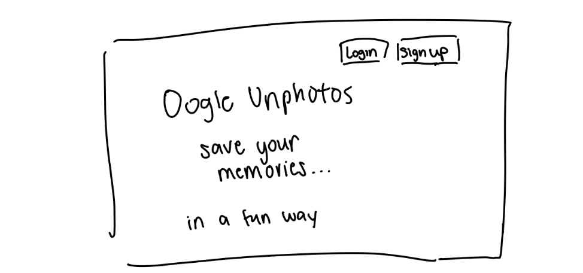

# Oogle Unphoto

## Tech
- React
- JavaScript
- Express
- MongoDB

## Overview

Oh no! Unfortunately, the photo storage service that you downloaded from the dark web, Oogle Unphoto, just broke up your uploaded photos into tiny scrambled pieces. Instead of seeing your photos, you see a bunch of tile puzzles that you now have to solve. So sad.

Oogle Unphoto is a web app that stores the photos that you upload...but life isn't always fair. Once the user's photos are uploaded to this photo storage app, the photos are cropped into a 3x3 grid, scrambling the pieces into a tile puzzle. Like any other photo storage app, users can register for an account, login to their account, and view the photos they uploaded. However, if you wanted to view your photo in full screen and in its full glory, you would have to complete the puzzle :(

This app combines the convenience of photo storage with the fun of interactive puzzles, adding an element of challenge to viewing and organizing photos. Users who successfully reassemble their images can gain both the satisfaction of solving a puzzle and the reward of viewing their complete photo.

## Data Model

The application will store users (username and password) and their photos.

- users can store multiple photos (by embedding)

User Model:

```javascript
{
  username: // username
  password: // a password hash,
  photos: [ // an array of photos that the user has uploaded
    ...
  ],
}
```

Photo Model:
```javascript
{
  image: // the image in base64 encoding
}
```

## [First Draft Schema](db.js) 

## Wireframes

/ - home page



/login - login page


/signup - signup page


/photos - all photos + upload modal


## Site Map


## Use Cases

### Use Case 1: Storing Photos
- Description
  - In this use case, users can upload custom photoss. The system takes these photos and their attributes and stores them in the database.
- Rationale
  - The user needs to store their photos because they want to store a backup of their photos in case their physical device is unable to recover its photos.
- Preconditions: 
  - The user must be registered and logged in to the service.
  - The user has prepared photos to upload.
- Flows:
  - General Flow:
    - The user selects the option to upload a photo within the app’s interface.
    - The user picks a photo file from their device to upload.
    - The user confirms the upload.
    - The system stores the photo in the database, assigning it a unique identifier for easy retrieval.
    - The system provides feedback to the user through visual confirmation.
  - Alternative Flow:
    - The user uploads a file type that is unsupported i.e. exceeds a size limit.
      - The system prompts the user to select another file.
    - The user exits out of the upload modal
      - The user returns to the view of all the photos.
- Post Conditions:
  - The uploaded photo is saved in the database.
  - The user can see the uploaded photo in their library.
- Exception Handling:
  - The system must verify that the uploaded photo does not exceed a size limit and the type of file is supported.

### Use Case 2: Playing Tile Puzzle
- Description:
  - In this use case, users play a tile puzzle in order to view their original photo. Once the tile puzzle is completed, the system displays the original photo that was initially uploaded. 
- Rationale:
  - The tile puzzle component provides a fun and interactive way to engage with their photos.
- Preconditions:
  - The user must be registered and logged in.
  - The user has uploaded their photo and can see their reordered photo in the gallery.
- Flows:
  - General Flow:
    - The user navigates to the photo gallery within the app to view their uploaded photos.
    - The user selects a photo they wish to play as a tile puzzle from their gallery.
    - Upon selection, the system opens a new interface dedicated to the tile puzzle, displaying the photo scrambled into a 3x3 grid of tiles.
    - The user interacts with the puzzle by clicking 2 tiles at a time, aiming to rearrange them into the correct order to form the original image.
    - Once the user rearranges the tiles correctly, the system detects that the puzzle is complete.
    - The system displays the original photo in full view, providing visual confirmation of the completed puzzle.
  - Alternative Flow:
    - The user exits the game and back to `/photos`
      - The library of photos is displayed.
- Post Conditions:
  - The user has successfully completed the tile puzzle and viewed the original photo.

## Research Topics

- (6 points) Using a frontend framework - React
  - React is a front-end framework for building user interfaces. React is widely used for its simplicity, flexibility, and efficiency in developing fast and responsive interfaces. React is known for its component-based architecture, allowing developers to build and maintain applications with less code duplication.
  - Candidate Modules or Solutions
    - Using TailwindCSS with React for styling
    - Implementing animation using libraries such as React Spring
  - Points of Research
    - Maintaining states within a component or within the app
    - Connecting with MongoDB
- (3 points) Using Vite
  - Vite is a local deployment server that leverages native ES modules to support fast start times and development experience. Unlike traditional bundlers, Vite only processes the parts of the code being worked on, making it highly efficient.
  - Candidate Modules or Solutions
    - ESLint for finding and fixing problems with code
  - Points of Research
    - Integrating ESLint into workflow 
    - Using Vite build to deploy to server
    - Configuring Vite with React
- (2 points) Using TailwindCSS
  - TailwindCSS is a utility-first CSS framework, important in rapidly building custom user interfaces. Developers can style components directly in HTML or JSX, promoting flexibility and design consistency.
  - Candidate Modules or Solutions
    - Styling configurations such as defining custom themes and colors
    - Using HeroIcons for free SVG images
  - Points of Research
    - Integrating Tailwind with React
    - How to configure styles using `tailwind.config.js`

11 points total out of 10 required points

## [Initial Main Project File](app.js) 

## Annotations / References Used
See source code

Icons
<a target="_blank" href="https://icons8.com/icon/14090/upload">Upload</a> icon by <a target="_blank" href="https://icons8.com">Icons8</a>

### Storing images in MongoDB
1. [GridFS to Store Images](https://www.mongodb.com/docs/drivers/node/current/fundamentals/gridfs)
2. [Convert Images to Base64 String](https://stackoverflow.com/questions/6150289/how-can-i-convert-an-image-into-base64-string-using-javascript)

